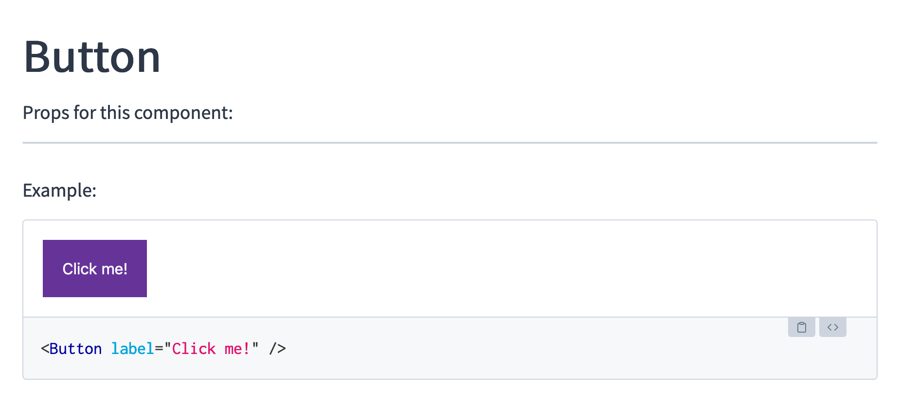

# Debugging Props component with Docz

Run `yarn start` in the `source/` directory. You should see a page documenting a Button component but the `docz/Props` component doesn't list any props.



## Setup

1. Run `yarn` in the `documentation` folder
2. Run `yarn start` in the `documentation` folder.

The `Props` component does not show any props for our `<Button>`. The `Playground` component displays the markup just fine, though.

## Folder structure

This example repo emulates a monorepo _without Lerna or Yarn workspaces_. This works (except for the bug described above) partially thanks to the custom configuration in the `documentation/gatsby-node.js` file.

```
docz-monorepo
├── README.md
├── source
│   ├── src
│   │   └── Button.jsx
│   └── package.json
└── documentation
    ├── test.mdx
    └── package.json
```
